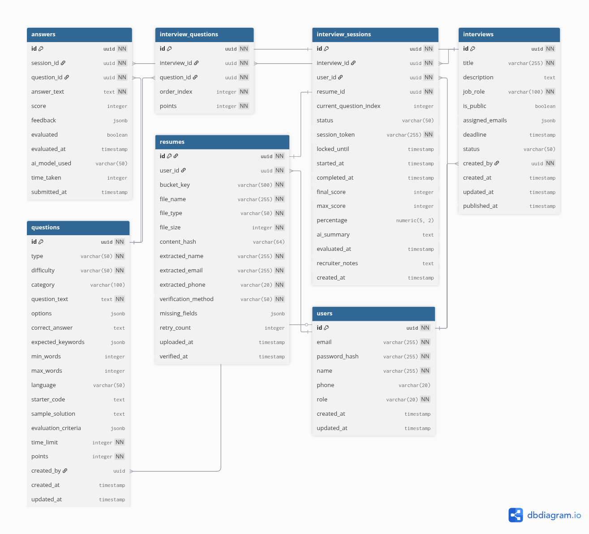

## Crisp Swipe

Technical interview platform with two roles:

-  Recruiters create interviews, manage candidates, and review results.
-  Candidates upload resumes and complete timed, multi-step interview sessions (with code editor and timers).

The backend is a Hono app running on Bun, the frontend is a React + Vite SPA served statically in production by the backend.

 

### Prerequisites

-  Bun (recommended latest) — see `https://bun.sh`
-  PostgreSQL database and a `DATABASE_URL`

### Environment variables

Create a `.env` file in the project root with at least:

Required

-  `DATABASE_URL` — Postgres connection string
-  `JWT_SECRET` — secret used to sign auth tokens

Optional

-  `PORT` — backend port (default: 3000)
-  `FRONTEND_URL` — used for generating links in emails/UX (default: `http://localhost:5173`)
-  `NODE_ENV` — affects cookie security flags (`production` enables `secure`)
-  `R2_ACCESS_KEY_ID`, `R2_SECRET_ACCESS_KEY` — Cloudflare R2 credentials for resume storage (endpoint and bucket are currently configured in code)
-  AI provider keys (enable corresponding providers at runtime):
   -  `OPENAI_API_KEY`
   -  `GROQ_API_KEY`
   -  `GOOGLE_GENERATIVE_AI_API_KEY`
   -  `MISTRAL_API_KEY`
   -  `COHERE_API_KEY`
   -  `CEREBRAS_API_KEY`

### Install

From the repo root (installs backend deps; frontend deps are installed as part of its build/dev scripts):

```bash
bun install
```

### Run (development)

Run backend and frontend in separate terminals for the best DX:

Terminal 1 — backend (Bun + Hono):

```bash
bun run dev
```

Terminal 2 — frontend (Vite dev server on 5173):

```bash
cd frontend
bun run dev
```

API will be on `http://localhost:3000`, frontend on `http://localhost:5173`.

Database (first run):

```bash
# after setting DATABASE_URL
bun run db-setup
```

### Build (production)

Builds the frontend and prepares the database:

```bash
bun run build
```

This runs:

-  `frontend` build (Vite) → outputs to `frontend/dist`
-  `postbuild` → `bun run db-setup`

### Start (production)

Serve the built SPA from the backend:

```bash
bun run start
```

Backend serves API routes under `/api` and static assets from `./frontend/dist`.

### Useful scripts

From root `package.json`:

-  `dev` — start backend in watch mode
-  `start` — start backend
-  `build` — build frontend (and run DB setup)
-  `db-setup` — initialize/migrate database
-  `db-push` / `db-migrate` / `db-generate` — Drizzle utilities
-  `health` — curl the backend health endpoint

### Notes

-  Cookies are configured to be `secure` only in production (`NODE_ENV=production`).
-  Resume storage uses Cloudflare R2; set `R2_ACCESS_KEY_ID` and `R2_SECRET_ACCESS_KEY` if using uploads locally. Endpoint/bucket are defined in `server/app.ts`.
